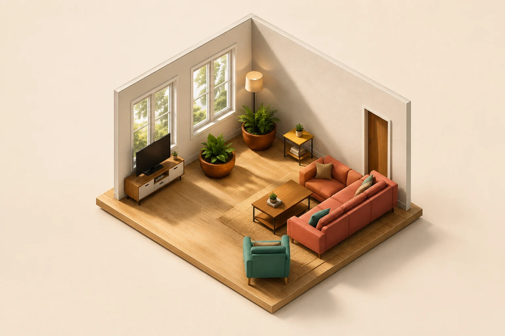

<div align="center">
  
  <h1>OpenHome3D</h1>
  <p><strong>Design a playful 3D home in the browser — then let local Codex AI understand or repaint it.</strong></p>
  <p>
    <a href="https://yuyou-dev.github.io/OpenHome3D/"><strong>▶ Try the browser demo</strong></a>
    · <a href="#install-with-codex-recommended">Install with Codex</a>
    · <a href="#community--pull-requests">Contribute</a>
    · <a href="#中文使用指南">中文</a>
  </p>
  <p><sub>Open source · MIT · No OpenHome3D account · No API key · Optional AI runs through your own local Codex CLI</sub></p>
</div>

---

OpenHome3D is the open-source edition of **家居生成器 Cartoon (Home Generator Cartoon)**. Start from a studio, one-bedroom, or two-bedroom home; let the seeded layout engine furnish it; then edit rooms, openings, structure, and furniture in a cel-shaded 3D diorama.

The [online demo](https://yuyou-dev.github.io/OpenHome3D/) runs entirely in the browser. Install the project locally to unlock the new Codex AI workflow.

## ✨ AI milestone: floor plan in, finished room out

The latest milestone adds a real AI layer to OpenHome3D, not just another editor control. Your own local [Codex CLI](https://github.com/openai/codex) gives the app two optional superpowers:

1. **Understand a floor plan** — import a PNG or JPEG; Codex recognizes rooms, doors, windows, connected openings, and balconies, then OpenHome3D builds an editable multi-room home.
2. **Repaint the 3D scene** — turn the current cartoon composition into a photorealistic, cinematic, anime, cyberpunk, watercolor, clay, or cel-style image, while keeping the room layout and camera framing as the guide.

| Editable OpenHome3D scene | Example local AI repaint |
| --- | --- |
|  |  |

The image on the right is an example repaint from the scene on the left. Generative images can reinterpret small details; the editable 3D scene always remains your source of truth.

### Why local Codex?

- OpenHome3D never asks for an API key or reads your Codex credential files.
- Codex manages its own ChatGPT login and runs only when you request floor-plan understanding or a repaint.
- The static GitHub Pages demo stays backend-free. AI buttons explain that local installation is required instead of silently failing.

## What you can make

- **A furnished whole home in one click** — 8 room types and 3 home templates; the same seed recreates the same layout.
- **An editable floor plan in 3D** — drag and resize rooms from the top view; add doors, windows, full-height openings, balcony parapets, and cutaway walls.
- **A room that feels like yours** — browse 337 bundled CC0 models, tune 18 parametric pieces, upload your own model, then move, rotate, duplicate, resize, or swap furniture.
- **A stylized presentation** — flat cel-shaded colors, ink outlines, soft shadows, isometric and perspective cameras, plus exportable project files.
- **Edits that survive regeneration** — hand-added, edited, locked and legacy furniture stays through Shuffle; density only rebuilds unprotected automatic decorations. Room resizing clamps existing positions, and changed wall connections are repaired with a notice when an opening must be removed.
- **Recovery and fast discovery** — 50-step session undo/redo, Chinese/English model search, and whole-home camera fitting on first load, reset and projection changes.
- **An AI-assisted concept image** — import a plan or repaint the designed room locally through Codex.

## Use OpenHome3D

### Try it now — no installation

Open the [live browser demo](https://yuyou-dev.github.io/OpenHome3D/). It includes the complete manual designer; local AI features are intentionally unavailable on the static site.

### Install with Codex (recommended)

These are instructions **for the Codex desktop app**, not terminal commands:

1. Open Codex Desktop and create a new task.
2. Copy only the sentence inside the code block for the outcome you want.
3. Paste it into the Codex chat box and send it. Codex will follow the linked runbook, preserve existing work, verify the result, and ask before destructive or system-level actions.

#### App + GitHub/Community Companion

Best for most contributors: installs the designer and the guided community/PR tools.

```text
Read and complete https://raw.githubusercontent.com/yuyou-dev/OpenHome3D/main/INSTALL.md to set up and run OpenHome3D, set up its Companion, verify both, and open the app in the built-in browser.
```

#### OpenHome3D app only

```text
Read https://raw.githubusercontent.com/yuyou-dev/OpenHome3D/main/INSTALL.md and set up, verify, run, and open only the OpenHome3D app; skip the Companion.
```

#### Update an existing installation

```text
Read https://raw.githubusercontent.com/yuyou-dev/OpenHome3D/main/UPGRADE.md and safely update my existing OpenHome3D app, preserve local work, verify it, restart it, and open it.
```

#### Remove the app

```text
Read https://raw.githubusercontent.com/yuyou-dev/OpenHome3D/main/UNINSTALL.md and prepare to remove only the OpenHome3D app; preview the exact files and preserve my work before asking me to confirm removal.
```

#### Set up the Companion only

```text
Read https://raw.githubusercontent.com/yuyou-dev/OpenHome3D/main/plugins/openhome3d-companion/LIFECYCLE.md and set up and verify the OpenHome3D Companion only, then explain how to activate it in a new Codex task.
```

#### Update the Companion only

```text
Read https://raw.githubusercontent.com/yuyou-dev/OpenHome3D/main/plugins/openhome3d-companion/LIFECYCLE.md and safely update and verify only my OpenHome3D Companion, then explain how to reload it in Codex.
```

#### Remove the Companion only

```text
Read https://raw.githubusercontent.com/yuyou-dev/OpenHome3D/main/plugins/openhome3d-companion/LIFECYCLE.md and prepare to remove only the OpenHome3D Companion; show me what will change and ask before removing its marketplace.
```

The app and Companion are independent; removing one never removes the other.

After installing or updating the Companion, fully restart Codex Desktop, create a new task, then attach **OpenHome3D Companion** from **Sources → Use plugins**. Ordinary prompt text alone does not attach a plugin.

### Install manually

Requires [Node.js](https://nodejs.org/) `^20.19.0 || >=22.12.0`, matching the installed Vite version.

```bash
git clone https://github.com/yuyou-dev/OpenHome3D.git
cd OpenHome3D
npm ci
npm run dev
```

Open the local URL printed by the terminal. The random port (40000–65000) is cached in `.port`; strict port mode fails if it is occupied. Stop the old service or remove `.port` before restarting to select another port. Built-in models ship with the repository; ordinary startup does not download assets.

To use the optional AI features, also install and sign in to Codex CLI, then run the project check:

```bash
npm i -g @openai/codex@latest
codex login
npm run doctor
```

`npm run doctor` checks Node compatibility, the Codex CLI version, and `codex login status`; it never reads credential files. GPT-6 Astra requires CLI **0.153.1 or newer** ([official changelog](https://learn.chatgpt.com/docs/changelog)); upgrade older versions with `npm i -g @openai/codex@latest`. Status and request preflight reject incompatible versions before starting a task. If Codex is unavailable, the browser designer still works.

## A five-minute first project

1. Choose **Home** and start with Studio, 1BR, or 2BR — or import a floor-plan image when running locally with Codex.
2. Open **Room** to change the active room type, dimensions, or partition height.
3. Press **Shuffle** until the seeded furnishing feels close, then drag and edit individual pieces.
4. Use the top toolbar to switch view, projection, pan mode, cutaway walls, windows, floor slab, and furniture visibility.
5. Use **Save** to download a portable `.home3d` project; **Open** restores it and **Layout** exports the compatible lightweight JSON. When local AI is available, open **AI Render** to make and compare a concept image.

Helpful controls: arrow keys nudge the selected item; `A` / `E` rotate it; `Alt` temporarily disables grid snap; right-drag or `Shift` + left-drag pans the camera.

## Editing recovery and project files


Undo/redo uses Ctrl/⌘ Z, Ctrl/⌘ Shift Z or Ctrl Y. A drag, continuous arrow-key edit or slider gesture counts as one step; the 50-step history lasts for the current page session. Layout, furniture, shell and floor-plan image restore together. Undoing a complete project import also restores its previous projection and grid; ordinary view changes do not become edit history. Upload-file and reference-photo management are outside undo; deleting an uploaded model clears history.

“New plan” asks before replacing the whole home. To add a room, use “Add room” in the Home tab. Template changes and imports replace the plan and can be undone.

The sidebar footer offers three file actions:

- **Save** writes a `.home3d` JSON package containing the current scene, preservation flags, shell/display/projection/grid settings, referenced upload GLBs, reference photos and original floor plan.
- **Open** accepts `.home3d` or legacy layout JSON and asks before replacement. Package import validates resources and assigns new uploaded-model and furniture IDs, preserving existing assets so the import can be undone.
- **Layout** exports the compatible lightweight JSON v1. Its confirmation lists omitted uploaded furniture and explains that images, wall height and display settings are omitted. Importing this format clears the unrelated floor-plan image.

Project packages contain resources used by the current scene; they omit unused uploads, AI render history, undo history and the current camera pose. Resources are embedded in JSON without compression. AI results can be downloaded separately.

The active scene is stored in localStorage; uploads, reference photos, AI history and the original floor plan use IndexedDB. Both are scoped to the browser origin (protocol, host and port). Changing the port or clearing website data can hide or remove previous work; save a project file before moving browsers or machines.

## Local AI behavior

The path is browser → Vite `/api/ai/*` → `codex exec`. The app does not read credentials or require an API key; `HOME3D_CODEX_BIN` can select the codex executable. Both floor-plan recognition and render orchestration explicitly select **GPT-6 Astra** (`--model gpt-6-astra`) with `high` reasoning effort, configured once in `scripts/ai-config.mjs` instead of inheriting the user's global default. See the [official model page](https://developers.openai.com/api/docs/models/gpt-6-astra). Rendering still calls codex's `image_gen` tool: GPT-6 Astra is the orchestration model, not a claim about the image tool's own model version.

Recognition returns structured JSON; rendering calls `image_gen` once. They share one execution slot. Login and busy status refresh automatically. Closing the render panel keeps the task running in the same page, with status in the top bar; reopen it to view the result or cancel. Reloading or closing the page ends the running request.

New render-history entries retain the actual input screenshot, prompt, reference-image snapshots and result from that task. Older image-only entries display only their result. If saving history fails, the current result remains available for immediate download. Ratios are requested as 1:1, 3:2 or 2:3; the image tool determines actual dimensions and can slightly change composition.

Only `npm run dev` provides AI endpoints. The Pages demo, production build and `npm run preview` show local-only guidance instead. CLI tool availability and output formats can change; implementation contracts are in [AGENTS.md](AGENTS.md).

## Community & Pull Requests

You do not need to know Git to participate.

### Use the Companion

The optional **OpenHome3D Companion** turns community participation into a guided Codex workflow. Ask it to open the community hub to:

- browse and summarize GitHub Discussions;
- draft a question, idea, showcase, or bug report in plain language;
- inspect your local changes, run the right checks, and prepare a Pull Request;
- preview every public post or PR before anything is published.

After attaching the plugin in a new Codex task, say:

```text
Open the OpenHome3D community hub.
```

Already changed the project? Ask:

```text
Check my current OpenHome3D changes, run the appropriate verification, and show me a contribution summary and Pull Request draft. Do not publish anything until I confirm.
```

### Use the traditional GitHub flow

1. Fork the repository and create a focused branch.
2. Make one coherent change and preserve the cel-shaded rendering and Neo-Brutalism UI conventions.
3. Run `npm run build`; run `npm run smoke` for layout changes and `npm run companion:test` for Companion changes.
4. Open a Pull Request that explains the user-visible outcome and how you verified it.

Use [Discussions](https://github.com/yuyou-dev/OpenHome3D/discussions) for questions, ideas, and showcases; use [Issues](https://github.com/yuyou-dev/OpenHome3D/issues) for reproducible bugs. See [CONTRIBUTING.md](CONTRIBUTING.md) for the full routing, verification, and authorship guide.

## More screenshots

| Furniture browser | Editing a selected piece |
| --- | --- |
|  |  |

## Maintainer commands

Most users only need `npm run dev`. Maintainers may also use:

| Command | What it does |
| --- | --- |
| `npm run dev` | Vite dev server on a cached random high port |
| `npm run build` | Strict app and Vite-config type checks + production build |
| `npm run smoke:pages` | Build and test the Pages subpath, assets and local-only AI guidance without mocks or publishing |
| `npm run build:pages` | Type checks + production build using `/OpenHome3D/` as the base URL |
| `npm run preview` | Serve `dist/`, without local AI endpoints |
| `npm run check` | Build, layout, editor/search/camera and mocked AI middleware regressions |
| `npm run smoke` | Layout determinism, bounds, collisions, door avoidance, templates, plan conversion and walls |
| `npm run smoke:editor` | Edit history, preservation, openings, plan-image recovery, search, camera and screenshot regressions |
| `npm run smoke:ai:live -- --run` | Explicit live check: one recognition and one generated image; requires a dev server and consumes account credits |
| `npm run smoke:ai` | Middleware tests with a simulated codex executable; no real AI calls |
| `npm run smoke:ui` | Headless Chrome screenshot, selected actions and console/HTTP error checks |
| `npm run smoke:interactions` | Browser editing and interaction regressions |
| `npm run smoke:project` | Package save/open, isolated-browser resource recovery, undo/redo and legacy compatibility |
| `npm run smoke:ai-flow` | Mocked AI status, background tasks, cancellation, failures and history |
| `npm run check:ui` | All browser regressions and overflow audit in sequence; requires a running dev server |
| `npm run audit:ui` | Multi-state, two-viewport overflow audit; findings fail the command |
| `npm run assets` | Fetch missing Kenney/KayKit sources and regenerate the manifest; completed sources are skipped |
| `npm run doctor` | AI environment preflight (Node, codex CLI, login); `--json` for machines |
| `npm run companion:test` | Validate Companion MCP, Apps UI and plugin manifest |
| `npm run scan:public` | Scan tracked and non-ignored untracked files for private data; also runs in CI |

Browser regressions need a running dev server and Chrome (`CHROME_PATH` overrides the executable). They read `.port` by default; use `APP_URL` for another instance. `smoke:ui` accepts `SHOT`, `WIDTH/HEIGHT` and `ACTIONS`; `audit:ui` accepts `SHOT_DIR`. Check the scripts for supported actions and actual test counts. All browser regressions mock AI routes, including status, and need no login or credits. The explicit `npm run smoke:ai:live -- --run` performs one real recognition and one real image generation through temporary middleware, using the dev server only for an isolated default-scene screenshot; it is deliberately excluded from `check` and `check:ui`. Run it only when live validation is intended.

Implementation contracts live in [AGENTS.md](AGENTS.md), and the maintenance/verification record is in [HANDOFF.md](HANDOFF.md). The app uses React, TypeScript, three.js / React Three Fiber, Zustand, and Vite. Both AI routes share `scripts/ai-config.mjs`; `scripts/ai-api.mjs` also supports the paginated image-result format introduced in newer Codex releases, while accepting older rollout formats. Image extraction and cleanup remain restricted to the current task's rollout.

OpenHome3D shares core editing and cartoon rendering with Home3D-Cartoon, while independently maintaining Pages deployment, installation lifecycle and the Companion. Shared changes are ported selectively and verified in each repository. Pages static assets must retain the `import.meta.env.BASE_URL` prefix.

## Assets, brand & license

The 337 bundled furniture models come from **Kenney Furniture Kit** and **KayKit Furniture / Restaurant Bits**. Both are CC0 and may be used freely; license copies are included under `public/models/*/LICENSE.txt`.

The in-app **家居生成器 Cartoon** brand remains intact in this open-source edition. OpenHome3D itself is released under the [MIT License](LICENSE) © 2026 yuyou-dev; third-party assets remain under their own licenses.

---

## 中文使用指南

**OpenHome3D** 是「家居生成器 Cartoon」的开源版：一个可以在浏览器里搭整宅、改户型、摆家具的卡通风 3D 家装工具。在线 Demo 无需安装、没有账号体系；本地安装后，还可以通过你自己的 Codex CLI 使用 AI 户型识别和效果图重绘，不需要 API key。

### ✨ 这次的重要里程碑：Codex AI

这次更新不是在编辑器里再加一个小按钮，而是为 OpenHome3D 补上了一条完整的 AI 工作流：

1. **看懂户型图**：上传 PNG/JPEG 户型图，Codex 会识别房间、门窗、内墙打通和阳台；OpenHome3D 再把结果修复并转换成可以继续拖拽、改尺寸、摆家具的 3D 整宅。
2. **把卡通方案重绘成效果图**：完成 3D 布局后，可以生成写实、电影感、动画、赛博霓虹、水彩、粘土或赛璐璐风格的图片，并用滑动对比查看 3D 原图与生成结果。

AI 只在本机开发服务器中运行。OpenHome3D 不读取 Codex 登录文件，也不要求你填写 API key；在线 Demo 仍然保持纯静态、纯浏览器运行。

### 三种开始方式

- **只想体验设计器**：直接打开[在线 Demo](https://yuyou-dev.github.io/OpenHome3D/)，不需要安装。
- **希望使用 AI 功能**：在本机安装项目，并确保 Codex CLI 已登录。
- **希望参与社区或提交 PR**：同时安装 OpenHome3D Companion，让 Codex 带你浏览讨论、整理改动和准备 PR。

### 在 Codex 里一句话安装（推荐）

下面代码框里的内容不是终端命令，而是要发给 **Codex Desktop** 的任务说明：

1. 打开 Codex Desktop，新建一个任务。
2. 选择你需要的场景，只复制代码框里面的一整句话。
3. 粘贴到 Codex 对话输入框并发送。Codex 会读取对应操作手册、保护已有修改、执行验证，并在删除或系统级安装前向你确认。

#### 完整安装：主程序 + Companion

```text
请阅读并完整执行 https://raw.githubusercontent.com/yuyou-dev/OpenHome3D/main/INSTALL.md，安装并运行 OpenHome3D，同时安装 Companion，完成两者的验证，并在内置浏览器中打开程序。
```

#### 只安装主程序

```text
请阅读 https://raw.githubusercontent.com/yuyou-dev/OpenHome3D/main/INSTALL.md，只安装、验证、运行并打开 OpenHome3D 主程序，跳过 Companion。
```

#### 升级已有主程序

```text
请阅读 https://raw.githubusercontent.com/yuyou-dev/OpenHome3D/main/UPGRADE.md，安全升级我现有的 OpenHome3D，保留本地修改，完成验证后重新运行并打开。
```

#### 准备卸载主程序

```text
请阅读 https://raw.githubusercontent.com/yuyou-dev/OpenHome3D/main/UNINSTALL.md，准备只卸载 OpenHome3D 主程序；先展示准确目录和待处理文件、保护我的修改，再向我确认是否移除。
```

#### 只安装 Companion

```text
请阅读 https://raw.githubusercontent.com/yuyou-dev/OpenHome3D/main/plugins/openhome3d-companion/LIFECYCLE.md，只安装并验证 OpenHome3D Companion，然后说明如何在新的 Codex 任务中启用它。
```

#### 只升级 Companion

```text
请阅读 https://raw.githubusercontent.com/yuyou-dev/OpenHome3D/main/plugins/openhome3d-companion/LIFECYCLE.md，只安全升级并验证我现有的 OpenHome3D Companion，然后说明如何让 Codex 重新加载它。
```

#### 只卸载 Companion

```text
请阅读 https://raw.githubusercontent.com/yuyou-dev/OpenHome3D/main/plugins/openhome3d-companion/LIFECYCLE.md，准备只卸载 OpenHome3D Companion；先展示会发生的变化，并在移除 marketplace 前向我确认。
```

安装或升级 Companion 后，需要完全退出并重新打开 Codex Desktop；新建任务后，从 **Sources → Use plugins** 选择 **OpenHome3D Companion**。仅在输入框里写插件名字并不会自动加载插件。

### 手动安装

需要 Node.js `^20.19.0 || >=22.12.0`：

```bash
git clone https://github.com/yuyou-dev/OpenHome3D.git
cd OpenHome3D
npm ci
npm run dev
```

终端会打印一个本地地址，打开它即可使用完整 3D 设计器。要启用可选 AI 功能，再执行：

```bash
npm i -g @openai/codex@latest
codex login
npm run doctor
```

两个 AI 流程统一使用 **GPT-6 Astra**（`gpt-6-astra`）和 `high` 推理档位，配置集中在 `scripts/ai-config.mjs`。GPT-6 Astra 负责识别与编排，效果图仍由其调用 `image_gen` 工具生成；不把编排模型与图像工具的模型版本混称。

最低需要 Codex CLI **0.153.1**。旧版使用 `npm i -g @openai/codex@latest` 升级，再运行 `codex --version` 和 `npm run doctor`；版本不兼容时状态检查和任务预检会提示升级。新版分页 rollout 的图片结果格式已兼容，且只读取/清理本次任务产物。Codex 暂不可用时只影响 AI 功能，不影响普通 3D 编辑。

### 第一次使用

1. 在「整宅 Home」里选择单间、一居或两居模板；本机 AI 可用时也可以直接导入户型图。
2. 在「房间 Room」里调整当前房间类型、面宽、进深和隔墙高度。
3. 点击「换一换 Shuffle」重排未保留的自动家具，再选中单件家具进行移动、旋转、缩放、复制或换模；手工修改后的家具默认保留。
4. 在顶栏切换视角、轴测/透视、平移模式，以及墙体剖切、门窗、楼板和家具显示。
5. 用「保存工程 Save」下载完整 `.home3d`，用「打开 Open」恢复，或用「仅布局 Layout」导出兼容旧格式的 JSON；需要概念效果图时，打开「AI 渲染」生成并对比结果。

### 编辑、保存与 AI 任务


- 手动添加、修改、锁定和旧版家具默认在「换一换」时保留；密度只更新未保护的自动装饰。房间尺寸调整只夹取现有家具位置，改房型保留家具及门窗；房间变化后自动规范门窗，断开的开口移除并提示。
- 顶栏提供最多 50 步会话撤销/重做（Ctrl/⌘ Z、Ctrl/⌘ Shift Z 或 Ctrl Y），连续操作合并为一步；布局与户型原图一起恢复。完整工程导入的撤销还恢复投影和网格。上传文件/参考照片管理不入历史，删除上传模型清空历史。
- 「新建方案」确认后覆盖整宅；增量添加使用「整宅 Home」里的「添加房间」。家具库支持中英文别名和多词交集搜索；首次打开、重置和投影切换适配整宅取景。
- 「保存工程」下载 `.home3d`，包含当前场景引用的上传模型、参考照片、户型原图和设置，可跨浏览器恢复；「打开」兼容工程包和旧 JSON，确认后替换且可撤销。「仅布局」保留轻量 JSON v1，并明确省略范围。
- 工程包不包含未用上传库、AI 历史、撤销栈或相机姿态；本地存储绑定浏览器源（含端口）。换浏览器、换电脑或清数据前先保存工程。
- 关闭 AI 面板会继续当前页面中的渲染，顶栏显示任务状态；重新打开可查看或取消，刷新/关闭页面会中止请求。新历史保存当次输入、提示词、参考图及结果，旧记录仅显示结果，历史写入失败仍可下载图片。

完整维护命令见上方 [Maintainer commands](#maintainer-commands)。日常使用 `npm run check`，启动 dev server 后运行 `npm run check:ui`；常规 AI 回归为模拟，不消耗额度。显式真实验证使用 `npm run smoke:ai:live -- --run`，执行一次识别和一次出图并消耗额度，不属于两个总门禁。`npm run smoke:pages` 独立检查静态子路径、资源和 AI 降级提示，不发布网站。

### 不会 Git，也可以参与和提交 PR

OpenHome3D Companion 是本项目配套的 Codex 插件。它可以打开可视化社区中心，帮你阅读 Discussions、把中文想法整理成英文草稿、检查本地修改、运行合适的验证，并准备标准 Pull Request。任何公开发布都会先给你看最终预览，并等待你的明确确认。

启用 Companion 后，可以直接对 Codex 说：

```text
打开 OpenHome3D 社区中心。
```

如果你已经改好了代码，可以说：

```text
请检查我当前对 OpenHome3D 的修改，运行合适的验证，先向我展示贡献摘要和 PR 草稿；不要发布，等我确认。
```

传统 GitHub 流程也完全支持：Fork 仓库 → 新建分支 → 完成一个聚焦的改动 → 运行 `npm run build` 和相关测试 → 提交 Pull Request。问题、想法和作品展示请优先发到 [Discussions](https://github.com/yuyou-dev/OpenHome3D/discussions)，可复现 Bug 请发到 [Issues](https://github.com/yuyou-dev/OpenHome3D/issues)。详细规范见 [CONTRIBUTING.md](CONTRIBUTING.md)。

本项目以 [MIT 协议](LICENSE)开源；Kenney / KayKit 家具资产为 CC0。

## Known limits · 已知限制

Rooms must be non-overlapping rectangles; combine rectangles for an L-shaped space. Furniture cannot be dragged between rooms. If a room is smaller than a piece, the piece is centered without silently rescaling it. Only some generation rules avoid door zones; rerun Shuffle after opening edits. Interior walls do not participate in cutaway. AI recognition may miss objects or estimate dimensions incorrectly; calibrate the result in the editor. Image generation may slightly alter composition.

房间须为不重叠矩形，L 形可用多个矩形拼接；家具不跨房间拖动，房间小于家具时只归中、不自动缩模。部分布局规则尚未避门，门窗编辑后需再次「换一换」才应用避让；内墙不参与剖切。识别结果需校准尺寸和漏报，效果图也可能略改构图。
